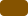
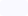
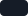
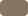

## Brand & Style

이 디자인 시스템은 프리미엄 전문 서비스의 신뢰감과 공원 산책이 주는 즐거운 에너지를 함께 표현하도록 설계되었습니다. 브랜드의 성격은 낙관적이고 따뜻하면서도 신뢰할 수 있는 방향으로 잡았습니다.

선택한 스타일은 친근하고 인간적인 감성을 더한 **Modern Corporate**입니다. 깔끔한 레이아웃과 넉넉한 여백을 활용해 바쁜 반려동물 보호자의 인지 부담을 줄이고, 동시에 전문성과 포용성을 함께 전달합니다.

## Colors

색상 팔레트는 행동을 유도하고 활력을 표현하기 위해 **“Golden Retriever” 오렌지**를 중심으로 구성했습니다. 여기에 차분한 분위기를 제공하는 **“Sky & Stone” 블루/그레이 톤**을 결합해, 산책의 즐거움과 신뢰감이 균형을 이루는 시각 체계를 만들었습니다.

| Token | Preview | HEX |
| --- | --- | --- |
| Primary |  | `#855300` |
| Primary Container |  | `#f59e0b` |
| Secondary |  | `#0058be` |
| Tertiary |  | `#00658b` |
| Surface |  | `#f9f9ff` |
| On-Surface |  | `#151c27` |
| Outline |  | `#867461` |

- **Primary:** 주요 행동, 활성 상태, 강조 요소에 사용합니다.
- **Secondary:** 부가 정보, 신뢰를 나타내는 요소, 내비게이션 포인트에 사용합니다.
- **Neutral:** 배경과 테두리에 사용하는 부드러운 회색 계열로, UI에 고급스러운 느낌을 더합니다.
- **Deep Charcoal:** 높은 가독성과 안정적이고 전문적인 인상을 위해 주요 텍스트 전체에 사용됩니다.

## Typography

이 디자인 시스템은 부드럽고 둥근 획과 뛰어난 가독성을 지닌 **Plus Jakarta Sans**를 사용합니다. 현대적인 분위기를 유지하면서도 일반적인 기하학적 형태를 지켜, 안심하고 사용할 수 있는 인터페이스를 만듭니다.

- **Headlines:** 굵은 글꼴을 사용해 명확한 계층 구조를 만들고, 사용자가 중요한 정보를 빠르게 파악할 수 있도록 합니다.
- **Body:** 넉넉한 줄 간격을 적용해 세련되고 깔끔한 느낌을 유지합니다.
- **Labels:** 버튼과 작은 메타데이터에 사용하며, 작은 크기에서도 쉽게 구분되도록 중간 또는 세미볼드 굵기를 사용합니다.

## Layout & Spacing

레이아웃은 모바일 우선의 일관성을 유지하기 위해 **Fixed Grid** 모델을 따르며, 휴대기기에서는 4열 시스템을 사용합니다.

- **Whitespace:** 넉넉한 여백을 기본 원칙으로 합니다. 요소를 지나치게 밀집시키지 말고, 섹션 사이의 세로 간격에는 `lg`와 `xl` 간격을 사용해 고급스러운 여유를 만듭니다.
- **Rhythm:** 모든 간격은 8px 기준에 따라 일관되게 구성합니다.
- **Containers:** 큰 화면에서는 콘텐츠를 최대 너비 안에서 중앙에 배치해, 사용자의 “Paths”(이용 흐름)가 집중되고 의도적으로 느껴지도록 합니다.

## Elevation & Depth

이 디자인 시스템은 **Ambient Shadows**와 **Tonal Layers**를 사용해 인터페이스의 깊이와 수직적 구조를 표현합니다.

- **Surfaces:** 메인 배경에는 가장 밝은 중립 색조를 사용합니다. 인터랙티브 카드는 순수한 흰색 표면에 배치해 한 단계 위에 떠 있는 것처럼 보이게 합니다.
- **Shadows:** 그림자는 매우 부드럽고 확산된 형태로 사용합니다. 블러는 20~40px, 불투명도는 4~8%로 설정하며, 회색이 탁하게 보이지 않도록 기본 오렌지 계열을 같이 섞어 살짝 따뜻한 느낌을 유지합니다.
- **Interactions:** 호버나 탭 시 요소가 살짝 떠오르는 듯한 효과를 주고, 그림자의 확산 범위를 넓혀 촉각적인 피드백을 제공합니다.

## Shapes

형태 언어는 **Rounded** 모서리를 중심으로 구성합니다. 이는 반려동물의 부드러운 특징을 연상시키며 앱에 안전하고 친근한 인상을 줍니다.

- **Buttons:** 주요 CTA 버튼에는 `12px`(`rounded-lg`) 반경을 사용해 견고하고 클릭하기 쉬운 느낌을 줍니다.
- **Cards:** 반려견 프로필과 산책 도우미 카드에는 `1.5rem`(`rounded-xl`) 반경을 사용해 부드럽고 독립적인 컨테이너 느낌을 만듭니다.
- **Inputs:** 전문적이면서도 현대적인 인상을 유지하기 위해 `0.5rem` 반경을 사용합니다.
- **Icons:** UI의 둥근 구조와 조화를 이루도록 끝부분과 모서리가 둥근 아이콘을 사용합니다.

## Components

### Buttons & Inputs

버튼에는 `rounded-lg`(12px)를 사용해 견고하면서도 친근한 느낌을 줍니다. 입력 필드에는 더 작은 `DEFAULT` 반경을 사용해 구조적인 정렬을 유지합니다. 모서리 반경이 지나치게 크지 않아 정보 입력과 탐색이 빠르게 진행되도록 합니다.

### Cards & Elevation

`card-profile`은 핵심 콘텐츠를 담는 대표 컨테이너입니다. `rounded-xl`과 색조가 가미된 앰비언트 그림자를 사용해 `surface` 배경 위에 떠 있는 듯한 느낌을 줍니다.

### Lists & Navigation

목록 항목은 넓은 터치 영역을 유지해야 하며, 시각적 복잡성을 높이지 않으면서 명확한 피드백을 제공할 수 있도록 호버 상태에 `surface-container-high`를 배치합니다.
